<div align="center">


<a href="https://github.com/webly-es">
  
</a>

<br/>

<a href="https://www.linkedin.com/in/jonathan-su%C3%A1rez-castellanos-35b88a353"></a>
<a href="mailto:jonathansuarezcaste201799@gmail.com"></a>


</div>

<div align="center">

</div>

---

```bash
┌──(jonathan㉿tenerife)-[~]
└─$ whoami
Jonathan Suárez Castellanos — Técnico de Sistemas, Redes y Soporte TI

┌──(jonathan㉿tenerife)-[~]
└─$ cat perfil.txt
[+] Experiencia : Técnico de Sistemas e Infraestructura — Grupo Gaviota (2018–2021)
[+] Formación   : FP Grado Superior ASIR (en curso) — Redes · Sistemas · Ciberseguridad
[+] Ubicación   : Tenerife, España  |  Remoto o presencial en Tenerife
[+] Idiomas     : Español (nativo) · Inglés (A2, mejorando)
[+] Objetivo    : Helpdesk / Sistemas / Redes  ──►  Blue Team · SOC · Ciberseguridad

┌──(jonathan㉿tenerife)-[~]
└─$ ls ~/skills/
active-directory/  windows-server/  linux/  tcp-ip/  vlans/  dns-dhcp/
pfsense/  wireshark/  helpdesk/  ticketing/  m365/  virtualizacion/
```

### `> cat experiencia.log`

```diff
+ [2018-2021] Grupo Gaviota · La Habana — Técnico de Sistemas e Infraestructura
  ├─ Gestión de usuarios, grupos y permisos en Active Directory (entorno corporativo hotelero)
  ├─ Control de accesos a recursos compartidos de red
  ├─ Supervisión de la infraestructura: DNS, conectividad y disponibilidad de servicios
  └─ Mantenimiento de equipos, impresoras y periféricos en entorno distribuido

+ [2026-hoy]  Agencia Wolna · Autónomo — Infraestructura web
  ├─ Gestión de dominios, DNS y despliegues
  └─ Entornos cloud (Vercel, Railway, Firebase) y pipelines CI/CD
```

### `> ls ~/labs/asir/`

| 🧪 Lab | 🛠️ Stack | 📝 Qué se practica |
|---|---|---|
| **Segmentación de red** | Cisco Packet Tracer · IOS | Diseño de VLANs, subnetting y enrutamiento inter-VLAN |
| **Dominio corporativo** | Windows Server · AD DS · GPO | Despliegue de AD, OUs, GPOs y recursos compartidos |
| **Perímetro & tráfico** | pfSense · Wireshark | Reglas de firewall, NAT y análisis de paquetes |

### `> cat ~/arsenal.conf`

<p>


</p>

### `> ./roadmap.sh --target ciberseguridad`

```text
[ RUNNING ] ASIR — Administración de Sistemas Informáticos en Red
[ QUEUED  ] Google IT Support  ·  CompTIA A+
[ QUEUED  ] Cisco CCNA  ·  CompTIA Network+
[ TARGET  ] CompTIA Security+  ──►  SOC Analyst / Blue Team
```

### `> ls ~/proyectos/`

- 🏋️ **[forja](https://github.com/webly-es/forja)** — App de entrenamiento: rutinas, registro de series y progreso (TypeScript).
- 🌐 **Demos web para negocios locales** — [pizzería](https://github.com/webly-es/demo-pizzeria) · [barbería](https://github.com/webly-es/-barberia-demo) · [restaurante](https://github.com/webly-es/demo-foodies-kebabs) — despliegue, DNS y hosting gestionados de principio a fin.

### `> top -stats`

<div align="center">


</div>

<div align="center">

</div>

---

<div align="center">

```console
$ echo "Abierto a oportunidades en Soporte TI, Sistemas y Redes — remoto o Tenerife"
```


</div>
